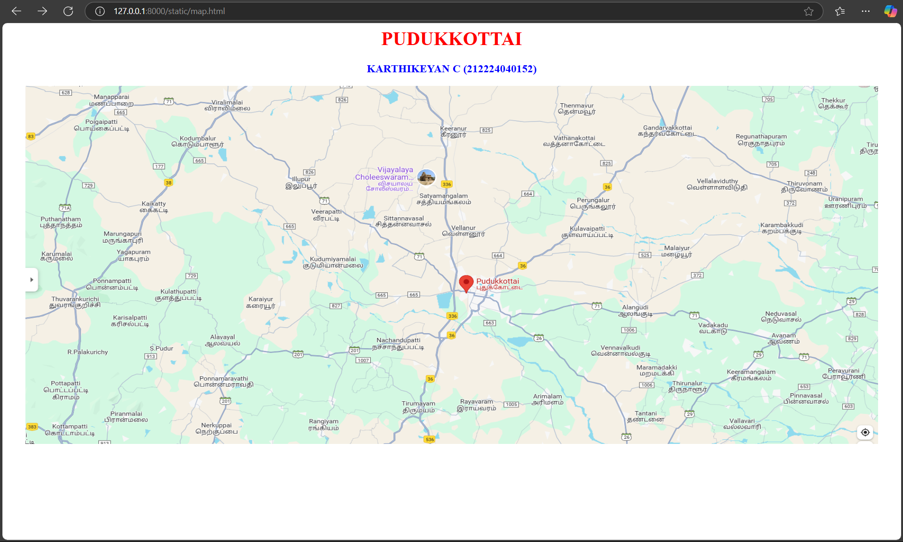
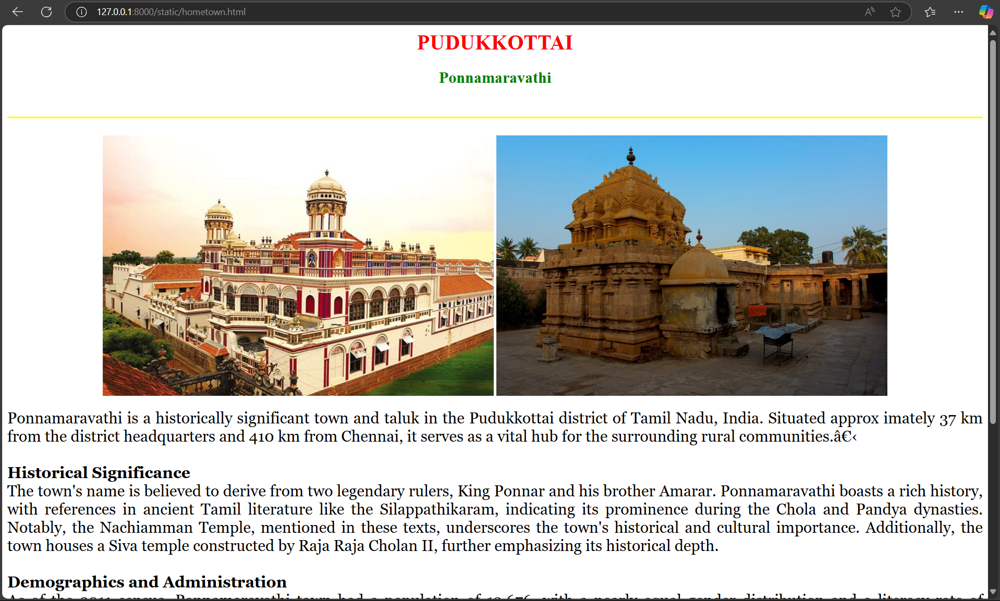
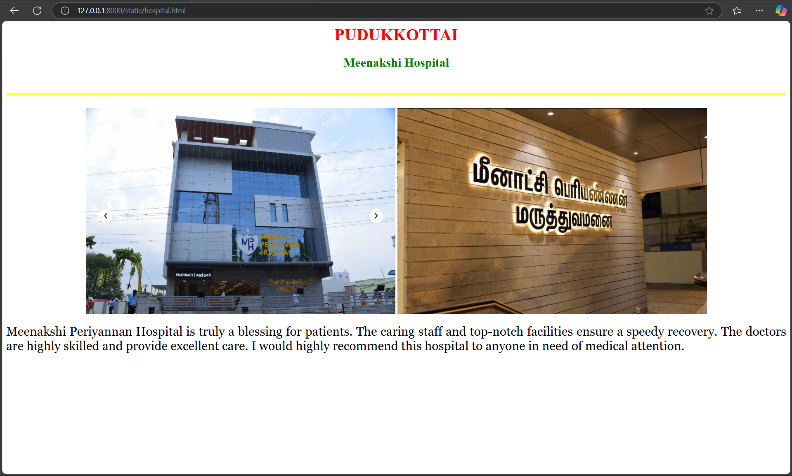
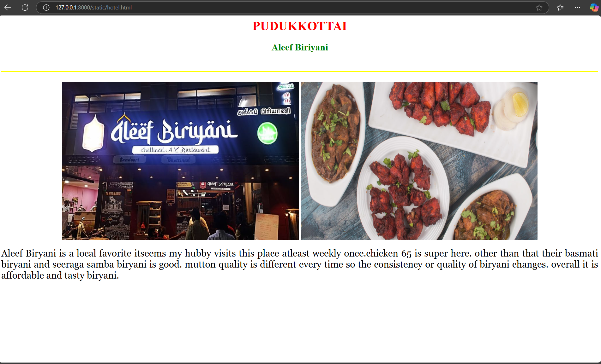
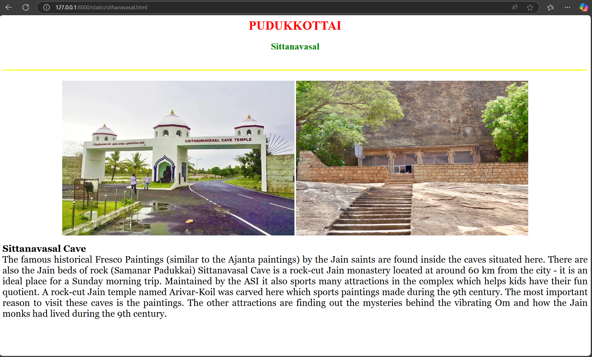
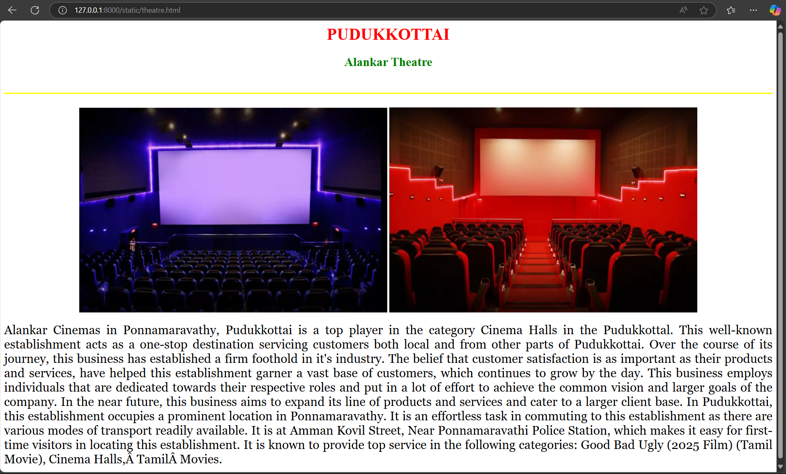

# Ex04 Places Around Me
## Date:21/04/2025

## AIM
To develop a website to display details about the places around my house.

## DESIGN STEPS

### STEP 1
Create a Django admin interface.

### STEP 2
Download your city map from Google.

### STEP 3
Using ```<map>``` tag name the map.

### STEP 4
Create clickable regions in the image using ```<area>``` tag.

### STEP 5
Write HTML programs for all the regions identified.

### STEP 6
Execute the programs and publish them.

## CODE
```
map.html

<html>
    <head>
        <title>My City</title>
    </head>
    <body>
        <h1 align="center">
            <font color="red"><b>PUDUKKOTTAI</b></font>
        </h1>
        <h3 align="center">
            <font color="blue"><b>KARTHIKEYAN C (212224040152)</b></font>
        </h3>
        <center>
            
            <map name="MyCity">
                <area target="" alt="Hospital" title="Hospital" href="hospital.html" coords="698,365,913,496" shape="rect">
                <area target="" alt="hometown" title="hometown" href="hometown.html" coords="250,360,220,100" shape="circle">
                <area target="" alt="theatre" title="theatre" href="theatre.html" coords="700,250,600,300" shape="rect">
                <area target="" alt="Sithanavasal" title="Sithanavasal" href="sithanavasal.html" coords="580,300,50,50" shape="circle">
                <area target="" alt="hotel" title="hotel" href="hotel.html" coords="60,60,150,150" shape="rect">
                <area target="" alt="" title="" href="" coords="" shape="0">
    
            </map>
        </center>  
    </body>
</html>

hometown.html

<html>
    <head>
        <title>My City</title>
    </head>
    <body>
        <h1 align="center">
            <font color="red"><b>PUDUKKOTTAI</b></font>
        </h1>
        <h2 align="center">
            <font color="green"><b>Ponnamaravathi</b></font>
        </h2>
        <br>
        <hr size="3" color="yellow">
        <br>
        <center>
        </center>
        <p align="justify">
            <font face="Georgia" size="5" color="black">
                Ponnamaravathi is a historically significant town and taluk in the Pudukkottai district of Tamil Nadu, India. Situated approx
                imately 37 km from the district headquarters and 410 km from Chennai, it serves as a vital hub for the surrounding rural communities.​ 
                <br>
                <br>
                <b>Historical Significance
                </b>
                <br>
                The town's name is believed to derive from two legendary rulers, King Ponnar and his brother Amarar. Ponnamaravathi boasts a rich history, with references in ancient Tamil literature like the Silappathikaram, indicating its prominence during the Chola and Pandya dynasties. Notably, the Nachiamman Temple, mentioned in these texts, underscores the town's historical and cultural importance.
                 Additionally, the town houses a Siva temple constructed by Raja Raja Cholan II, further emphasizing its historical depth.
                 <br>
                 <br>
                 <b>Demographics and Administration</b>
                 <br>
                 As of the 2011 census, Ponnamaravathi town had a population of 12,676, with a nearly equal gender distribution and a literacy rate of approximately 80.26%. The broader Ponnamaravathi taluk encompasses 42
                  panchayat villages and had a population of 108,579, with a sex ratio of 1,017 females for every 1,000 males. 
                  <br><br>
                  <b>Economy and Connectivity</b>
                  <br>
                  Agriculture forms the backbone of Ponnamaravathi's economy, with the town acting as a central market for numerous neighboring villages. Crops such as rice, sugarcane, groundnuts, cereals, and various vegetables are cultivated extensively in the region. 
                  The town is well-connected by road to major cities like Tiruchirappalli (Trichy) and Madurai, facilitating trade and mobility.
                  <br><br><b>Cultural and Religious Sites</b>
                  <br>Ponnamaravathi is home to several temples that reflect its rich cultural tapestry. The ancient Nachiamman Temple, linked to early Tamil literature, stands as a testament to the town's historical significance. Another notable site is the Muthumariamman Temple in nearby Konnaiyur, 
                  located about 35 km from Pudukkottai, renowned for its vibrant festivals and religious importance.
            </font>
        </p>
    </body>
</html>


hospital.html

<html>
    <head>
        <title>My City</title>
    </head>
    <body>
        <h1 align="center">
            <font color="red"><b>PUDUKKOTTAI</b></font>
        </h1>
        <h2 align="center">
            <font color="green"><b>Meenakshi Hospital</b></font>
        </h2>
        <br>
        <hr size="3" color="yellow">
        <br>
        <center>
        </center>
        <p align="justify">
            <font face="Georgia" size="5" color="black">
                
                Meenakshi Periyannan Hospital is truly a blessing for patients. The caring staff and top-notch facilities ensure a speedy recovery. 
                The doctors are highly skilled and provide excellent care. I would highly recommend this hospital to anyone in need of medical attention.
                
            </font>
        </p>
    </body>
</html>


hotel.html

<html>
    <head>
        <title>My City</title>
    </head>
    <body>
        <h1 align="center">
            <font color="red"><b>PUDUKKOTTAI</b></font>
        </h1>
        <h2 align="center">
            <font color="green"><b>Aleef Biriyani</b></font>
        </h2>
        <br>
        <hr size="3" color="yellow">
        <br>
        <center>
        </center>
        <p align="justify">
            <font face="Georgia" size="5" color="black">
                
                Aleef Biryani is a local favorite itseems my hubby visits this place atleast weekly once.chicken 65 is super here. other than that their basmati biryani and seeraga samba biryani is good. mutton quality is different every time so the consistency or quality of biryani changes. overall it is affordable and tasty biryani.
                
            </font>
        </p>
    </body>
</html>


sithanavasal.html

<html>
    <head>
        <title>My City</title>
    </head>
    <body>
        <h1 align="center">
            <font color="red"><b>PUDUKKOTTAI</b></font>
        </h1>
        <h2 align="center">
            <font color="green"><b>Sittanavasal</b></font>
        </h2>
        <br>
        <hr size="3" color="yellow">
        <br>
        <center>
        </center>
        <p align="justify">
            <font face="Georgia" size="5" color="black">
            <b>Sittanavasal Cave</b>
            <br>
            <br>
            The famous historical Fresco Paintings (similar to the Ajanta paintings) by the Jain saints are found inside the caves situated here. There are also the Jain beds of rock (Samanar Padukkai) Sittanavasal Cave is a rock-cut Jain monastery located at around 60 km from the city - it is an ideal place for a Sunday morning trip. Maintained by the ASI it also sports many attractions in the complex which helps kids have their fun quotient.

A rock-cut Jain temple named Arivar-Koil was carved here which sports paintings made during the 9th century. The most important reason to visit these caves is the paintings. The other attractions are finding out the mysteries behind the vibrating Om and how the Jain monks had lived during the 9th century.    
            </font>
        </p>
    </body>
</html>


theatre.html

<html>
    <head>
        <title>My City</title>
    </head>
    <body>
        <h1 align="center">
            <font color="red"><b>PUDUKKOTTAI</b></font>
        </h1>
        <h2 align="center">
            <font color="green"><b>Alankar Theatre</b></font>
        </h2>
        <br>
        <hr size="3" color="yellow">
        <br>
        <center>
        </center>
        <p align="justify">
            <font face="Georgia" size="5" color="black">
                Alankar Cinemas in Ponnamaravathy, Pudukkottai is a top player in the category Cinema Halls in the Pudukkottal. This well-known establishment acts as a one-stop destination servicing customers both local and from other parts of Pudukkottai. Over the course of its journey, this business has established a firm foothold in it's industry. The belief that customer satisfaction is as important as their products and services, have helped this establishment garner a vast base of customers, which continues to grow by the day. This business employs individuals that are dedicated towards their respective roles and put in a lot of effort to achieve the common vision and larger goals of the company. In the near future, this business aims to expand its line of products and services and cater to a larger client base. In Pudukkottai, this establishment occupies a prominent location in Ponnamaravathy. It is an effortless task in commuting to this establishment as there are various modes of transport readily available. It is at Amman Kovil Street, Near Ponnamaravathi Police Station, which makes it easy for first-time visitors in locating this establishment. It is known to provide top service in the following categories: Good Bad Ugly (2025 Film) (Tamil Movie), Cinema Halls, Tamil Movies. 
                
                
            </font>
        </p>
    </body>
</html>
```
## OUTPUT








## RESULT
The program for implementing image maps using HTML is executed successfully.
